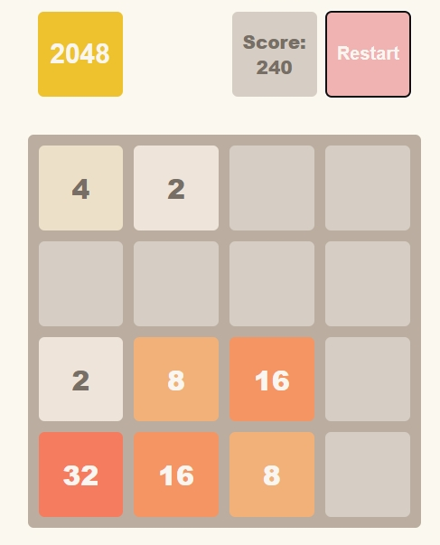

# The 2048 game

<a href='https://sergiats.github.io/Game_2048/'>DEMO LINK</a>

2048 is the easy and fun puzzle game and playing it you may spend some free minutes with pleasure!

<strong>HOW TO PLAY:</strong> Use your arrow keys to move the tiles. Tiles with the same number merge into one when they touch. Add them up to reach 2048!

</img>

# Technologies used:

<ul>
  <li>JS;</li>
  <li>HTML;</li>
  <li>SCSS;</li>
</ul>
